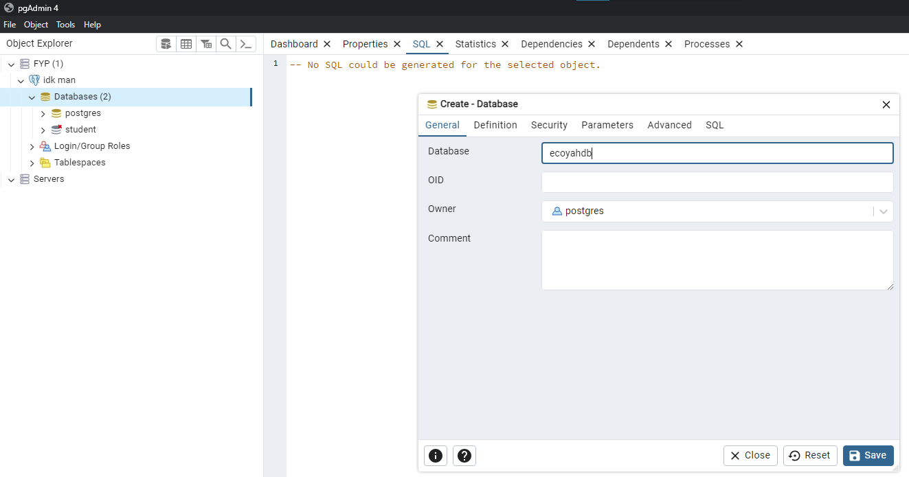

# FYP-24_DCS\_\_CodeAbility-Crew_EcoYah

Final Year Project 2024

### Client - Frontend

Ensure there is a `.env` file under the `client` folder and it contains `REACT_APP_BACKEND_URL=http://localhost:8000`.

```
cd client
# if first time
npm i
npm run start
```

# Databases Set Up

### 1.(PostGresSQL)

> Do this before running the server!

We are using PostGresSQL for this. Ensure you have PostGresSQL installed and you have access to the credentials. `pgAdmin` is recommended to be installed.



1. Create a new database called `ecoyahdb`
2. Update username and password in [data-source.ts](server/src/config/data-source.ts). Ensure that they match the user account in PostGresSQL.

### 2. S3 Image Database

Under `server>.env`, add in the following environment variables. `IMAGE_DATABASE` accepts either `local` or `online`. Local will create an `uploaded_images` under the `server` directory.

```
S3_ACCESS_KEY=<Access Key Here>
S3_SECRET=<Secret Key Here>
S3_BUCKET=fyp-ecoyah
IMAGE_DATABASE=online
```

Run this with `local` when developing as much as possible. When running with local, ensure the following file structure has been created.

```
- server/
    - uploaded_images/
        - temp/ *compulsory
        - default/ *compulsory
        - donor/ *optional, create these folders to group images
        - etc.../
```

## Server

> Before running the server, ensure that you have a `.env` file under the `server` folder with the `PORT=8000`.
> Ideally, your `.env` should be of this following format.
> Created an `.env.production` file too if you are going to be building this. The URL should be "https://<\*.com>" without trailing back slashes.

```
PORT=XXXX
DATABASE_USERNAME=xxxx
DATABASE_PASSWORD=xxxx
RUN_SEED_FILE=false
```

> > The seed file should only be run once or else, you will face unique constraint error. Hence, set this value to be true. Run the server. After which, change it back to false and RESTART the server.

```
cd server
# if first time
npm i
npm run dev
```

# How do I know it is actually working

If you have supposedly set up everything nicely and correctly on the first time:

> > Frontend
> > You should see the landing page on `http://localhost:3000/`.

> > Backend

- Run `http://localhost:{Depending on what you declare in the .env}`, you should see Hello World!
